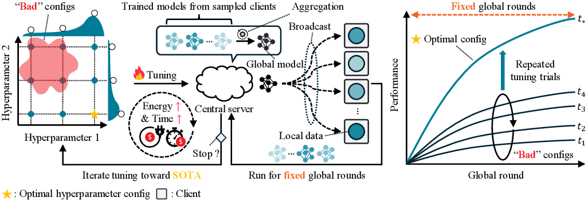
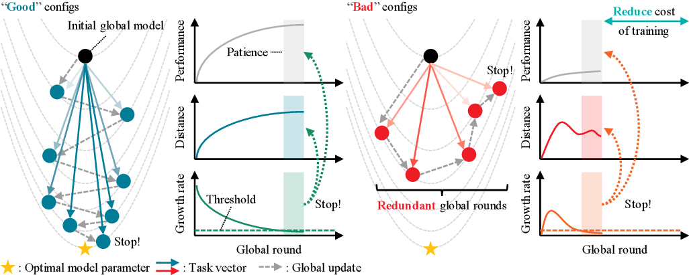

# Beyond Fixed Rounds: Data-Free Early Stopping for Practical Federated Learning

<div align="center">

[](https://arxiv.org/abs/TODO)
[](LICENSE)

**Anonymous Author(s)**
_Submitted to MICCAI 2026_

</div>

---

## Overview

<div align="center">
  
</div>

<em>Fig. 1. Illustration of resource inefficiency in FL hyperparameter tuning. Since standard FL protocols use a fixed number of global rounds, "bad" configurations waste computational and communication resources. This motivates the need for early stopping in FL for scalable and practical deployment.</em>

<br>

### Motivation

Federated Learning (FL) enables privacy-preserving collaborative training without transmitting raw data. However, existing FL methods rely on a **pre-defined fixed number of global rounds**, leading to significant waste when hyperparameter configurations fail to converge. Moreover, conventional early stopping requires **validation data at the server**, which violates the core FL privacy principle.

### Key Highlights

- **First data-free early stopping framework** for federated learning
- **Plug-and-play** compatibility with 10 state-of-the-art FL methods
- Screens bad configurations in fewer than **2% of the fixed-round budget**

---

## Method

<div align="center">
  
</div>

<em>Fig. 2. Illustration of the proposed data-free early stopping framework. The server monitors the growth rate of the task vector using only global model parameters and stops training once the growth rate falls below the threshold.</em>

<br>

The core intuition is grounded in **task vector concept**: as FL training converges, the cumulative displacement of the global model from its initialization—the *task vector* $\mathbf{v}_r = \theta_r - \theta_0$—grows at a diminishing rate.

We define the **growth rate** of the accumulated optimization distance $\delta_r = \|\mathbf{v}_r\|_2$ as:

$$g_r = \frac{\delta_r - \delta_{r-1}}{\delta_{r-1}}, \quad r \geq 2$$

Training is halted at round $r^*$ when the growth rate falls below a sensitivity threshold $\tau$ for $\rho$ consecutive rounds (patience):

$$\kappa_r = \mathbf{1}(g_r < \tau) \cdot (\kappa_{r-1} + 1), \quad \kappa_1 = 0$$

$$r^* = \min\{r \geq 2 \mid \kappa_r \geq \rho\}$$

The framework requires **only two hyperparameters** (τ, ρ) and operates entirely on server-side parameters, making it fully compatible with the FL model-only transmission paradigm.

---

## Supported FL Methods

| # | Method | Category | Reference |
|:---:|:---|:---:|:---|
| 1 | **FedAvg** | SGD-basis | [McMahan et al., AISTATS 2017](http://proceedings.mlr.press/v54/mcmahan17a/mcmahan17a.pdf) |
| 2 | **FedProx** | SGD-basis | [Li et al., MLSys 2020](https://arxiv.org/abs/1812.06127) |
| 3 | **FedDyn** | SGD-basis | [Acar et al., ICLR 2021](https://openreview.net/pdf?id=B7v4QMR6Z9w) |
| 4 | **SCAFFOLD** | SGD-basis | [Karimireddy et al., ICML 2020](https://arxiv.org/abs/1910.06378) |
| 5 | **FedSAM** | SAM-basis | [Qu et al., ICML 2022](https://proceedings.mlr.press/v162/qu22a/qu22a.pdf) |
| 6 | **FedSpeed** | SAM-bassis | [Sun et al., ICLR 2023](https://openreview.net/pdf?id=bZjxxYURKT) |
| 7 | **FedSMOO** | SAM-basis | [Sun et al., ICML 2023](https://proceedings.mlr.press/v202/sun23h.html) |
| 8 | **FedGamma** | SAM-basis | [Dai et al., TNNLS 2024](https://ieeexplore.ieee.org/abstract/document/10269141) |
| 9 | **FedLESAM** | SAM-basis | [Fan et al., ICML 2024](https://arxiv.org/abs/2405.18890) |
| 10 | **FedWMSAM** | SAM-basis | [Li et al., NeurIPS 2025](https://arxiv.org/abs/2511.22080) |

---

## Getting Started

### Requirements

Pull the Docker image:

```bash
docker pull rocm/pytorch:rocm7.2_ubuntu24.04_py3.12_pytorch_release_2.7.1
```

Install additional dependencies:

```bash
pip install tqdm timm medmnist
```

### Repository Structure

```
.
├── train.py              # Main training script
├── dataset.py            # Dataset loading and partitioning
├── utils.py              # Utility functions
├── client/               # Client-side FL method implementations
│   ├── fedavg.py
│   ├── fedprox.py
│   ├── feddyn.py
│   ├── scaffold.py
│   ├── fedsam.py
│   ├── fedspeed.py
│   ├── fedsmoo.py
│   ├── fedgamma.py
│   ├── fedlesam.py
│   └── fedwmsam.py
├── server/               # Server-side aggregation and early stopping
│   ├── server.py
│   ├── FedAvg.py
│   └── ...
├── optimizer/            # Custom optimizer implementations
├── shell/                # Experiment shell scripts
│   ├── run0.sh           # Effectiveness experiment
│   ├── run1.sh           # Non-IID distribution experiment
│   ├── run2.sh           # Threshold sensitivity experiment
│   └── run3.sh           # Ablation study
├── result1.py            # Results for Sec 3.2 (Effectiveness)
├── result2.py            # Results for Sec 3.2 (Non-IID Impact)
├── result3.py            # Results for Sec 3.2 (Threshold Impact)
├── ablation.py           # Results for Sec 3.2 (Ablation)
└── figure/               # Paper figures
```

### Datasets

The experiments use two medical imaging benchmarks from [MedMNIST v2](https://github.com/MedMNIST/MedMNIST):

| Dataset | Task | Classes | Source |
|---|---|---|---|
| **DermaMNIST** (Skin Lesion) | Multi-class classification | 7 | [HAM10000](https://www.nature.com/articles/sdata2018161) |
| **BloodMNIST** (Blood Cell) | Multi-class classification | 8 | [Acevedo et al., 2020](https://www.sciencedirect.com/science/article/pii/S2352340920303681) |

The data will be automatically downloaded via the `medmnist` package. Datasets are partitioned across **N=100 clients** with **M=10** clients sampled per round, under three non-IID settings:
- **Label skew** (Dirichlet, coefficient c)
- **Label skew** (Pathological, shards per client c)
- **Quantity skew** (coefficient c)

---

## Running Experiments

All experiments use **ConvNeXtV2-Nano** as the local backbone with pretrained weights from `timm`.

### Experiment 1: Effectiveness of Proposed Framework

Reproduces Fig. 3 — trajectory comparison between proposed and validation-based early stopping.

```bash
bash shell/run0.sh
python result1.py
```

### Experiment 2: Impact of Non-IID Data Distributions

Reproduces Table 1 — performance differences across non-IID settings and FL methods.

```bash
bash shell/run1.sh
python result2.py
```

### Experiment 3: Impact of Threshold (τ)

Reproduces Fig. 4 — sensitivity analysis of the stopping threshold τ ∈ {0.005, 0.01, 0.05, 0.1}.

```bash
bash shell/run2.sh
python result3.py
```

### Experiment 4: Ablation Study

Reproduces Table 2 — efficiency of the framework in screening bad configurations.

```bash
bash shell/run3.sh
python ablation.py
```

### Training Arguments

| Category | Argument | Default | Description |
|:---:|:---|:---:|:---|
| **General** | `--method` | `FedAvg` | FL method to use |
| **General** | `--dataset` | `BloodMNIST` | Dataset (`BloodMNIST` or `DermaMNIST`) |
| **General** | `--seed` | `0` | Random seed |
| **FL Setup** | `--comm-rounds` | `500` | Maximum number of global rounds |
| **FL Setup** | `--total-client` | `100` | Total number of clients |
| **FL Setup** | `--active-ratio` | `0.1` | Fraction of clients sampled per round |
| **FL Setup** | `--local-epochs` | `5` | Number of local training epochs |
| **Early Stopping** | `--proposed` | `False` | Use proposed data-free early stopping |
| **Early Stopping** | `--validation` | `False` | Use validation-based early stopping |
| **Early Stopping** | `--threshold` | `0.005` | Growth rate threshold $\tau$ |
| **Early Stopping** | `--patience` | `10` | Patience parameter $\rho$ |
| **Data Partitioning** | `--non-iid` | `False` | Enable non-IID partitioning |
| **Data Partitioning** | `--split-rule` | `Dirichlet` | Partitioning rule |
| **Data Partitioning** | `--split-coef` | `0.1` | Heterogeneity coefficient $c$ |

**Example: Run proposed early stopping with FedSpeed on DermaMNIST**

```bash
python train.py \
  --proposed \
  --non-iid \
  --dataset DermaMNIST \
  --num_class 7 \
  --pretrain \
  --method FedSpeed \
  --seed 0 \
  --split-coef 0.1 \
  --threshold 0.01 \
  --patience 10
```

---

## Acknowledgements

This repository builds upon the FL simulator framework from [woodenchild95/FL-Simulator](https://github.com/woodenchild95/FL-Simulator).
